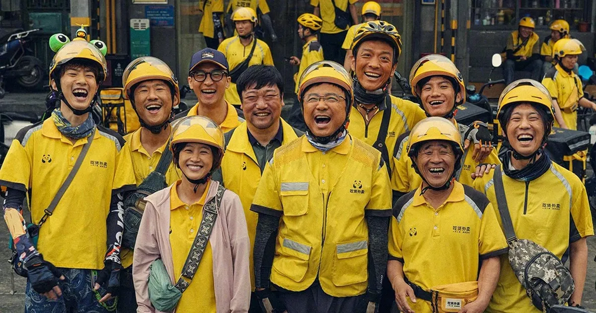

+++
title = "Sinh tồn"
date = "2026-07-24"
description = "Sinh tồn"
author = "minix"
+++

Khi đi làm chúng ta thường có xu hướng tin rằng công việc hiện tại của mình là bất biến, sự ổn định là vĩnh viễn và bằng cấp, kỹ năng, mạng lưới quan hệ… là thứ khiến chúng ta khác biệt so với thế giới, ta đồng nhất bản ngã của mình với các giá trị bên ngoài. 
Câu hỏi đặt ra là: **Nếu không còn những thứ đó, ta là ai? Ta có giá trị gì?**

Việc tin vào sự ổn định trong một xã hội nhiều biến động và luôn luôn thay đổi là một niềm tin mù quáng. Khi dấn thân vào con đường kiếm tiền, mưu sinh, sinh tồn trong xã hội, chúng ta có thể sẽ nhận ra những con người mà thường ngày chúng ta ít khi xem trọng lại là những con người dũng cảm, vượt lên chính mình và họ sống mà không mong chờ ngày mai mình sẽ trở thành ai hay có sống một cuộc đời rực rỡ hay không. Mọi thứ chỉ đơn giản là ý nghĩa sống của một con người - **“Sinh tồn”**

Trong ngành IT, vòng xoáy đào thải diễn ra cực kỳ dữ dội, việc giữ kỷ luật bản thân để luôn học hỏi mỗi ngày đôi khi khiến một con người nhiều đam mê, nghị lực cũng phải kiệt sức. Bộ phim Upstream khắc họa rõ hình ảnh mà ở đó cho dù ta có là một nhân viên cực kỳ thành công, vị trí việc làm tốt, địa vị xã hội cao, bằng cấp đầy đủ… thì ta cũng giống như bao người lao động khác, vật lộn **mưu sinh giữa dòng đời**.

Vốn dĩ tương lai là bất định, chúng ta để giữ cho bản thân không phải lo lắng thường có xu hướng tin vào một số niềm tin sau:

- Nếu tôi có nhiều bằng cấp, chứng chỉ nhà tuyển dụng sẽ trả cho tôi một mức lương cao, công việc ổn định.
  - Thực tế: Những chứng chỉ đó vốn dĩ chứng minh cho năng lực chứ không phải là mục đích. Nhà tuyển dụng vốn chỉ tin ta đã học qua những kiến thức đó, nhưng có thể những kiến thức, kỹ năng đã học lại không còn phù hợp với thời đại, hoặc phù hợp với trí tưởng tượng của nhà tuyển dụng. Vì vậy nên mới có phỏng vấn công việc và thời gian thử việc. Ngoài ra trong lúc đi làm ví dụ như nếu bạn nói bạn chạy xe giỏi hơn anh Grab đồng nghiệp thì ai chứng kiến cho bạn ngoài những con số KPI vô nhân tính như thời gian chạy xe trung bình, số lượt đánh giá tốt… trên Dashboard, những con số đã bỏ qua các kỹ năng khác như chạy xe cẩn thận, chăm sóc khách hàng tốt, sản phẩm không thấy lỗi (Cái này liệu do làm quá tốt hay do không làm?)
- Kỹ năng networking sẽ giúp cho tôi có một công việc khi tôi không có việc làm.
  - Thực tế tàn khốc ở chỗ, việc networking vốn dĩ là một nhu cầu quan trọng của con người bị biến thành mục đích cho một nhu cầu khác. Vốn dĩ giao tiếp giữa người với người là để kết nối với nhau, xây dựng sự tin tưởng và giúp đỡ lẫn nhau, có qua có lại. Khi xây dựng một mối quan hệ, ta nên coi nó là kết bạn, những người bạn mới sẽ khiến cuộc sống bớt nhàm chán và ta sẽ học hỏi được nhiều điều từ họ. Networking là kết bạn và nó khiến cuộc sống vui hơn để khi không có việc làm bạn có người để chia sẻ hơn là một công cụ để dự phòng rủi ro (tiền tiết kiệm, bảo hiểm…)
- Tôi có một chức vụ như Leader, Trưởng phòng, Giám đốc thì nghĩa là tôi xuất chúng.
  - Thực tế tàn khốc ở chỗ, các vị trí quản lý là do các lãnh đạo khác đặt lên để có người chịu trách nhiệm khi xảy ra vấn đề **“Nắm kẻ có tóc chứ không ai nắm kẻ trọc đầu”**. Vốn dĩ mục đích của các vị trí này là như vậy nên người đứng đầu sẽ phải chịu hai hướng áp lực: Một là ở trên xuống, hai là ở dưới lên. Tình huống này buộc ta phải đưa ra lựa chọn. Một người khi làm lãnh đạo thì nên là người không cần quá giỏi chuyên môn nhưng là người biết mình là ai, mình làm được gì, mình có thể làm gì cho mọi người (cả cho cấp trên và cho nhân viên mình đang quản lý). Một khi làm được việc đó, bạn vốn không cần một danh hiệu, bạn là một lãnh đạo trong lòng của mọi người. Khi cơ hội đến thì danh hiệu sẽ là một kết quả minh chứng cho quá trình. Quyền lực có sức mạnh thay đổi nhiều thứ nhưng riêng sự tự do hay tình thương chân thật thì không.

Những niềm tin vốn không xấu, nó là cơ chế bảo vệ cho cái tôi trong mỗi con người. Nhưng nếu không còn những thứ đó, khi chúng ta hoàn toàn lột bỏ những giá trị bên ngoài của cái tôi, khi rơi vào trạng thái bất định, thứ gì neo giữ cho ta tiếp tục sống. Sẽ đến một thời điểm trong cuộc đời nếu còn sống ta sẽ phải trả lời câu hỏi đó, khi chúng ta chẳng còn gì ngoài cái tôi to lớn.

Trong vòng lặp sinh tồn ta đặt câu hỏi: Tôi là ai?

Tôi là một người chồng, một người con, một người bạn, một người đồng nghiệp, một người thầy, một người học trò… và rất nhiều con người trong một cuộc đời của một con người.
